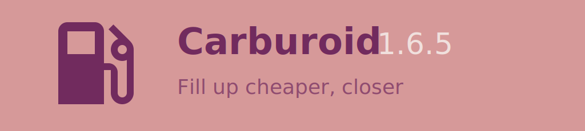
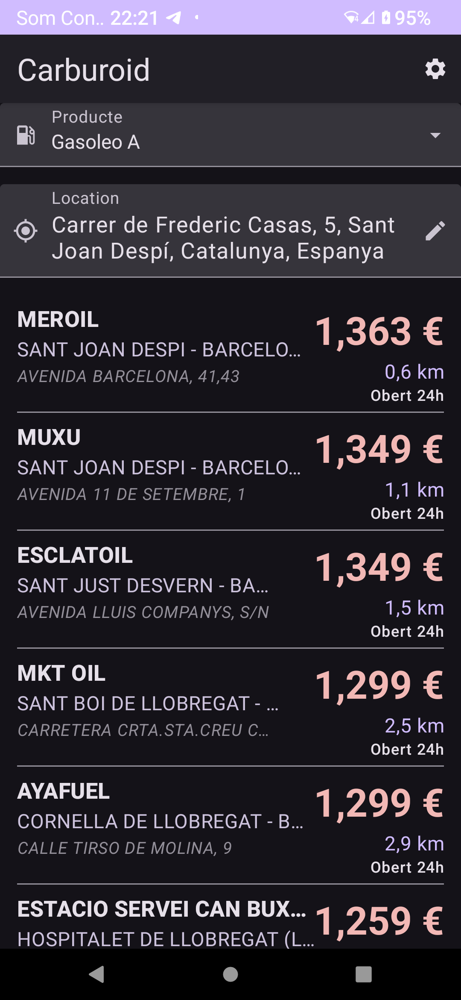
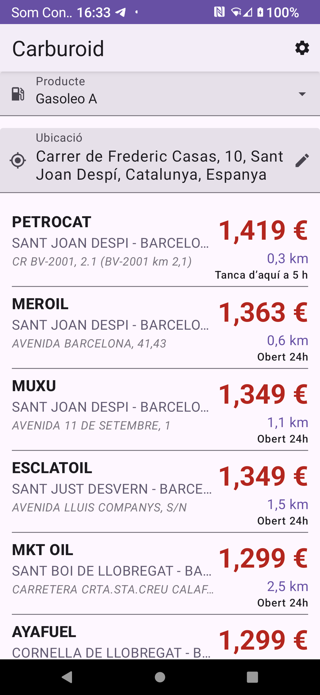
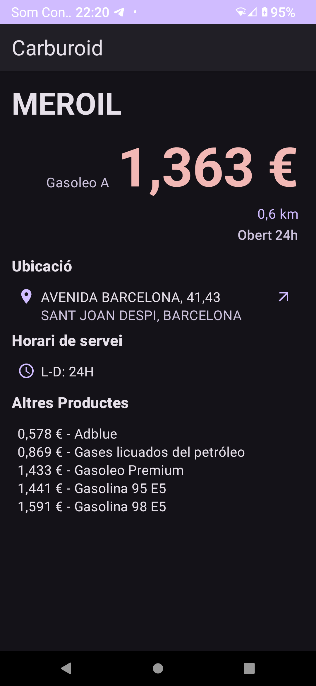
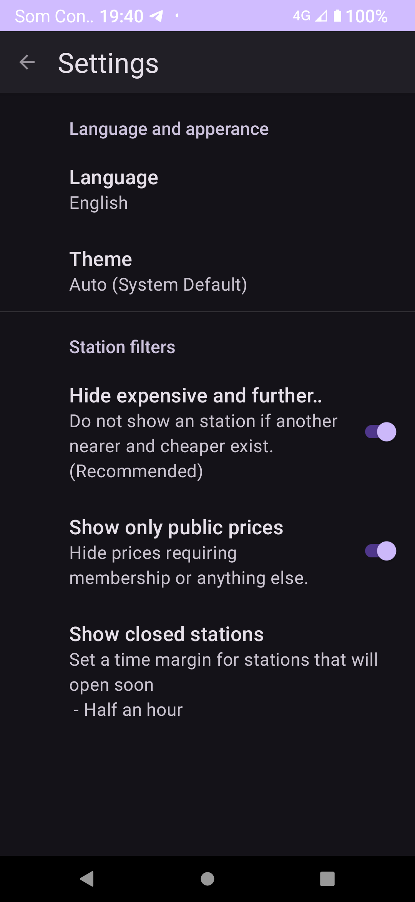

# Carburoid

Search Spanish Gas Stations

Find the nearest and cheapest Spanish gas stations, for Android

Features:

- Show only relevant gas stations: either closer or cheaper than others
- Discards stations without your product
- Discards closed ones unless they open soon
- Stations that open or close soon are not used to discard others, just in case you get there late or early
- See discarded stations by disabling any filtering criteria
- List and detail views
- Open a station location in your chosen map application
- Translations to Spanish, Catalan, Basque, Aragonese and more to come
- Dark and Light themes

<!-- end-of-description -->

