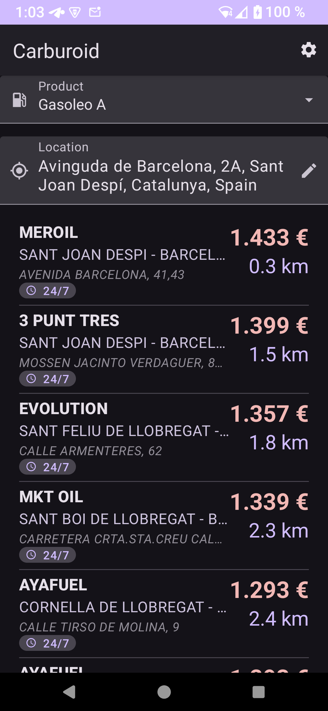
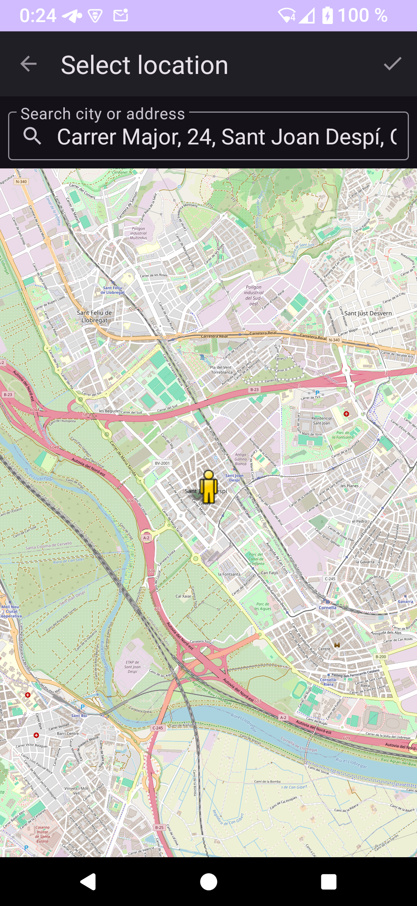
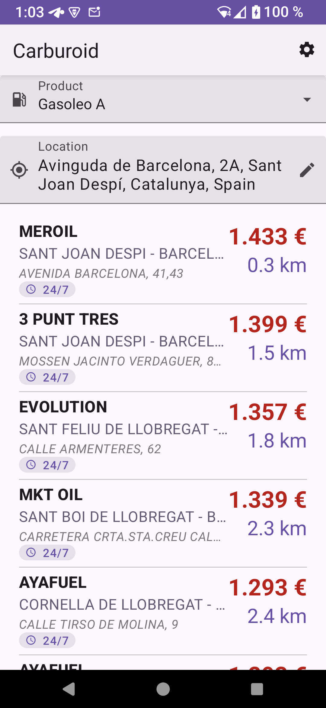
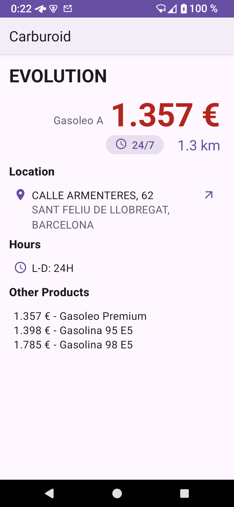
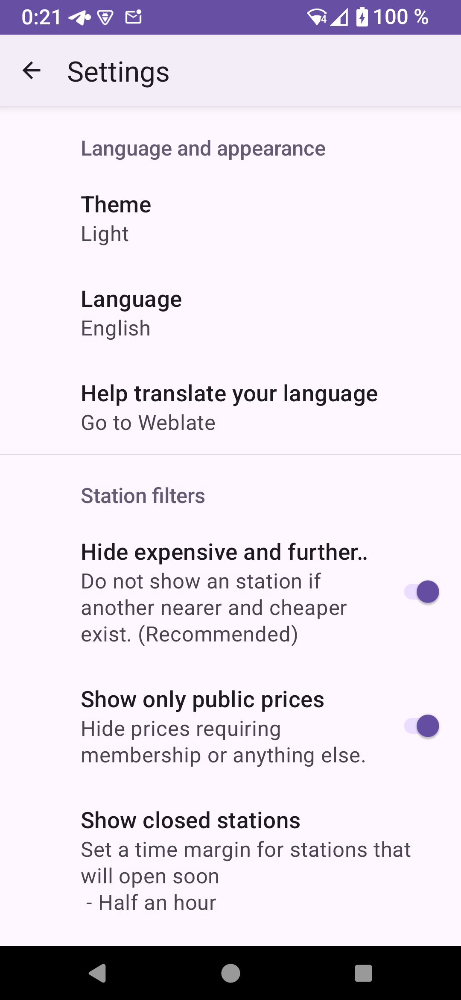

# Carburoid

Find gas stations by price and distance in Spain and France.

Carburoid shows only gas stations worth considering.
Sorted by distance, whenever a station is more expensive than the closer ones, it is hidden.
This reduces the list from thousands to a few dozens.
To choose a station, just scroll down to improve the price until the distance is not worth for you the saving.

Features:

- 🏛️ Official government data sources (Spain, France)
- 🎯 Only relevant gas stations: either closer or cheaper than others
- 🕒 Smart about opening and closing hours
- 🗺️ Integrates with your preferred map application
- 🌐 Translations available in Spanish, Catalan, Basque, Galician, Aragonese…
- ☀️ Dark and Light themes

<!-- end-of-description -->

## License

Copyright © 2025-2026 David García Garzón

This program is free software: you can redistribute it and/or modify
it under the terms of the GNU Affero General Public License as published by
the Free Software Foundation, either version 3 of the License, or
(at your option) any later version.

This program is distributed in the hope that it will be useful,
but WITHOUT ANY WARRANTY; without even the implied warranty of
MERCHANTABILITY or FITNESS FOR A PARTICULAR PURPOSE.  See the
GNU Affero General Public License for more details.

You should have received a copy of the GNU Affero General Public License
along with this program.  If not, see <https://www.gnu.org/licenses/>.

